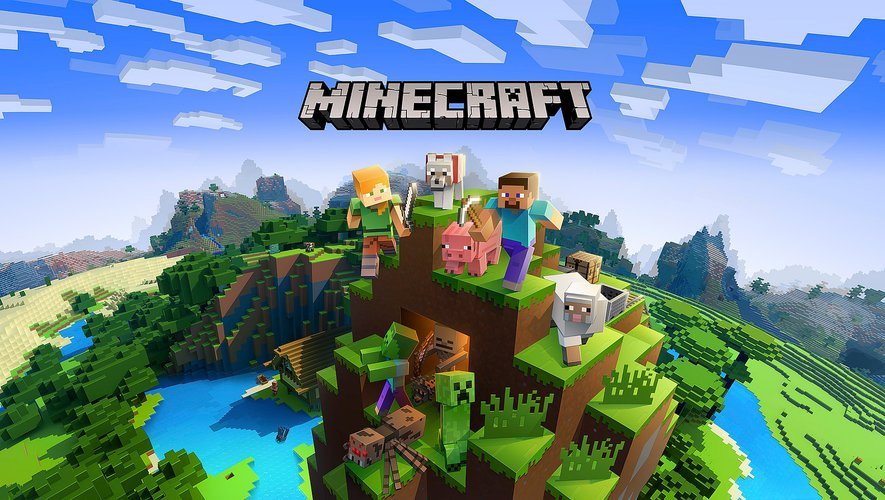

<!--
N.B.: This README was automatically generated by https://github.com/YunoHost/apps/tree/master/tools/README-generator
It shall NOT be edited by hand.
-->

# Minecraft pour YunoHost

[](https://dash.yunohost.org/appci/app/minecraft)    
[](https://install-app.yunohost.org/?app=minecraft)

*[Read this readme in english.](./README.md)*

> *Ce package vous permet d'installer Minecraft rapidement et simplement sur un serveur YunoHost.
Si vous n'avez pas YunoHost, regardez [ici](https://yunohost.org/#/install) pour savoir comment l'installer et en profiter.*

## Vue d'ensemble

Minecraft is a sandbox construction game, whose gameplay involves players interacting with the game world by placing and breaking various types of blocks in a three-dimensional environment. In this environment, players can build creative structures, creations, and artwork on multiplayer servers and singleplayer worlds across multiple game modes. 


**Version incluse :** 1.19~ynh2

## Captures d'écran



## Avertissements / informations importantes

## Configuration

:warning: ARM architecture is not supported.

For server administration, use the Minecraft console or RCON (which is open on port 25575 with your password).

### Rcon Clients

- https://github.com/Tiiffi/mcrcon/releases (in C)

### Start/Stop/Restart/Check Status Minecraft

- ```systemctl start minecraft```
- ```systemctl stop minecraft```
- ```systemctl restart minecraft```
- ```systemctl status minecraft```

### Location

The folder of your servers is: `/home/yunohost.app/minecraft`

### Supported Servers
 
1. Minecraft (Vanilla)
2. Minecraft (Vanilla snapshot)
3. Spigot
5. Paper
 
## Documentation

 * Non-official documentation: https://minecraft.fandom.com/wiki/Tutorials/Setting_up_a_server


## Documentations et ressources

* Site officiel de l'app : <https://www.minecraft.net/>
* Documentation officielle de l'admin : <https://minecraft.gamepedia.com/Tutorials/Setting_up_a_server>
* Documentation YunoHost pour cette app : <https://yunohost.org/app_minecraft>
* Signaler un bug : <https://github.com/YunoHost-Apps/minecraft_ynh/issues>

## Informations pour les développeurs

Merci de faire vos pull request sur la [branche testing](https://github.com/YunoHost-Apps/minecraft_ynh/tree/testing).

Pour essayer la branche testing, procédez comme suit.

``` bash
sudo yunohost app install https://github.com/YunoHost-Apps/minecraft_ynh/tree/testing --debug
ou
sudo yunohost app upgrade minecraft -u https://github.com/YunoHost-Apps/minecraft_ynh/tree/testing --debug
```

**Plus d'infos sur le packaging d'applications :** <https://yunohost.org/packaging_apps>
